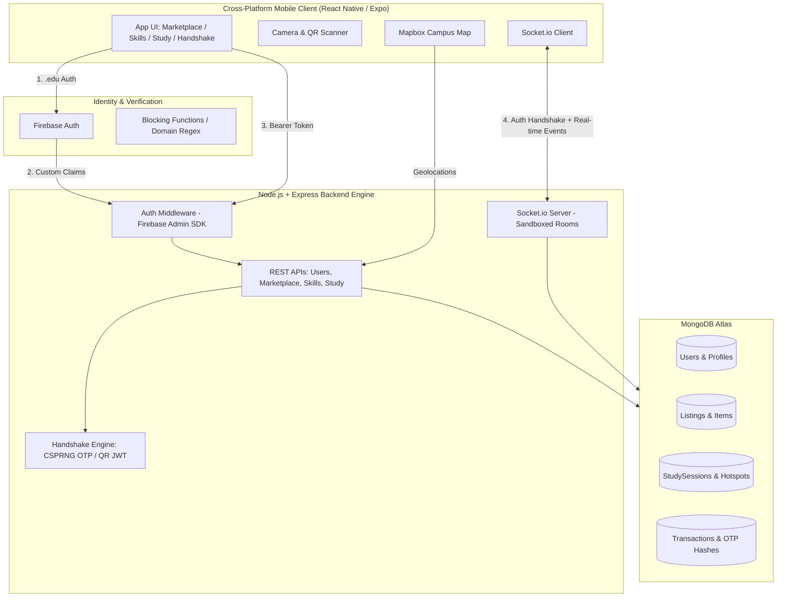
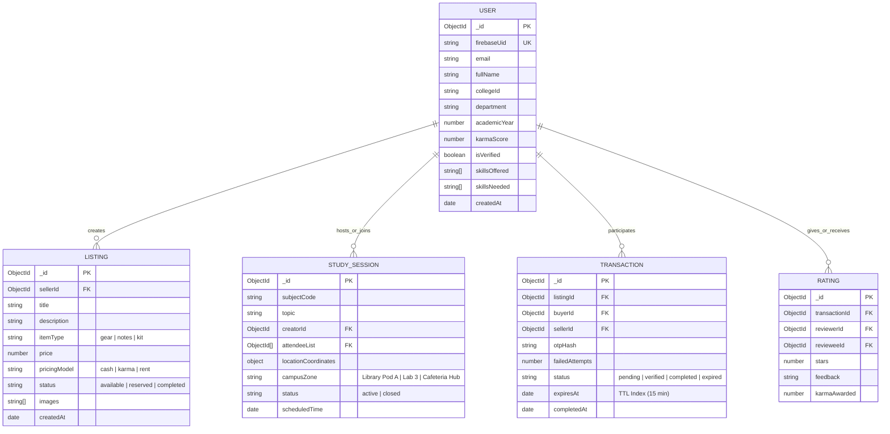
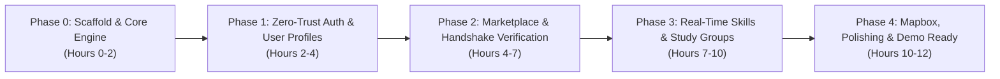

# CampusConnect: Master Implementation & Fast-Track Execution Plan

**Project:** CampusConnect | **Event:** CodeBlitz 2.0 (HackForge) | **Institution:** Pranveer Singh Institute of Technology (PSIT)  
**Core Domain:** Verified Peer Exchange & Student Collaboration  

---

## 1. Executive Summary & Architectural Overview

CampusConnect is a closed-campus, trust-verified mobile ecosystem uniting:
1. **Campus Marketplace:** Buy/sell/rent idle academic equipment (lab coats, drafting kits, books, notes) with cash or karma tokens.
2. **Peer Skill Exchange:** Discover peer mentors, request 1-on-1 tutoring, code reviews, and project guidance.
3. **Study Group Finder:** Discover and organize study groups matched by subject/module and campus location hotspots.
4. **Zero-Trust Security & Trust Engine:** Institutional domain gating (`@psit.ac.in`), CSPRNG OTP & Ephemeral QR Handshake Verification executed inside atomic transactions, Socket.io sandboxed channels, and Karma token mechanics.



---

## 2. Project Directory Structure

```
campus-connect/
├── backend/
│   ├── src/
│   │   ├── config/             # MongoDB, Firebase Admin, Environment config
│   │   ├── controllers/        # Auth, User, Marketplace, Skill, Study, Handshake
│   │   ├── middlewares/        # authMiddleware, rateLimiter, socketAuth
│   │   ├── models/             # User, Listing, StudySession, Transaction, Rating
│   │   ├── routes/             # REST Endpoints (/api/v1/...)
│   │   ├── services/           # CryptoService (CSPRNG, SHA-256, timingSafeEqual), KarmaService
│   │   ├── sockets/            # Socket.io handlers (study rooms, exchange handshake)
│   │   ├── utils/              # Response formatters, domain validators
│   │   └── server.js           # Server & Socket initialization
│   ├── tests/                  # API and Unit Tests
│   └── package.json
│
├── mobile/                     # React Native (Expo SDK)
│   ├── assets/                 # Icons, campus maps, splash screens
│   ├── src/
│   │   ├── api/                # Axios client & REST services
│   │   ├── components/         # Shared UI (Cards, QR Viewer, Camera Scanner, MapView)
│   │   ├── context/            # AuthContext, SocketContext, KarmaContext
│   │   ├── navigation/         # Tab & Stack Navigators
│   │   ├── screens/
│   │   │   ├── auth/           # Login, Domain Verification, Skill Onboarding
│   │   │   ├── marketplace/    # Browse, Add Listing, Item Details, Chat & Handshake
│   │   │   ├── skills/         # Find Mentor, Tutoring Requests, Profile View
│   │   │   ├── study/          # Mapbox Campus Hubs, Active Rooms, Group Chat
│   │   │   └── profile/        # Karma, Badges, History, Ratings
│   │   └── utils/              # Helpers & Constants
│   ├── App.js
│   └── package.json
└── README.md
```

---

## 3. Database Schema Design (MongoDB Atlas)



---

## 4. Phased Implementation Roadmap (Optimized for Minimum Required Time)

To deliver a production-ready, fully functional MVP in minimal turnaround time, the execution is structured into **5 distinct phases**:



### ⏱️ Detailed Phase Breakdown

| Phase | Milestone / Focus | Key Deliverables | Fast-Track Velocity Enabler |
| :--- | :--- | :--- | :--- |
| **Phase 0** | **Environment & Architecture Scaffolding** | • Unified repository setup (`backend/` Node.js + `mobile/` React Native/Expo)<br>• Mongoose schema definitions & connection pool<br>• Socket.io server skeleton & Base UI theme | Pre-configured boilerplate structure and mock harness for non-blocking local dev. |
| **Phase 1** | **Institutional Auth & Trust Engine Core** | • `.edu` / `@psit.ac.in` domain regex validator<br>• Firebase token validation middleware<br>• Profile creation (skills offered/needed, karma balance) | Mock auth bypass switch for local testing + live Firebase Auth verification. |
| **Phase 2** | **Marketplace & Cryptographic Handshake** | • Listing CRUD + category filtering (gear/notes)<br>• CSPRNG 6-digit OTP generation + SHA-256 hash storage<br>• Ephemeral QR code generation (JWT payload)<br>• `crypto.timingSafeEqual` & atomic MongoDB transaction commit for karma payout | Isolate CryptoService with automated unit tests for instant validation. |
| **Phase 3** | **Peer Skills, Study Groups & WebSockets** | • Peer skill discovery & request queue<br>• Study group creation by subject code / campus zone<br>• Socket.io room sandboxing & live messaging channels<br>• Rate limiter (30 msgs/min per socket client) | Reusable chat UI component shared between 1-on-1 peer exchange and study group rooms. |
| **Phase 4** | **Mapbox Integration, Ratings & Demo Flow** | • Mapbox campus hotspot overlays (Library, Labs, Safe Exchange Zones)<br>• Peer rating submission & karma leaderboards<br>• End-to-end user journey test (`Auth -> Discover -> Match/Chat -> Handshake`) | Pre-seed PSIT campus coordinates and sample listings for instantaneous live demo. |

---

## 5. Security & Threat Mitigation Directives

| Threat Vector | Mitigation Strategy | Implementation Mechanism |
| :--- | :--- | :--- |
| **Public Domain Spoofing** | Reject non-institutional domains | Regex check `@psit.ac.in` / `.edu` in Firebase trigger & API middleware |
| **Brute-Force OTP** | Rate limiting on verification | Max 5 failed attempts per transaction; 15-minute lockout |
| **Timing Attacks** | Constant-time string comparison | `crypto.timingSafeEqual(Buffer.from(a), Buffer.from(b))` |
| **Replay Attacks** | Immediate OTP/QR invalidation | Invalidate token and hash upon first successful transaction |
| **Chat Spam & DoS** | Socket.io packet throttling | Rate limiter capped at 30 messages/minute per client socket |
| **Double-Spending / Inconsistent State** | Atomic ledger updates | `session.withTransaction()` commit updating transaction state & awarding karma |

---

## 6. Execution Plan & Next Steps

1. **Step 1:** Initialize the project root with `backend/` (Node.js/Express) and `mobile/` (React Native Expo).
2. **Step 2:** Implement Backend Database Models, Crypto Handshake Engine, and Domain Validation Middleware.
3. **Step 3:** Implement Core REST APIs (Marketplace, Study Sessions, Skills, Handshake) with test coverage.
4. **Step 4:** Integrate Socket.io server with authentication and sandboxing.
5. **Step 5:** Build Mobile UI Screens (Auth, Marketplace, Study Groups, QR Scanner/Generator, Mapbox view).
6. **Step 6:** Execute full integration test and prepare demo dataset.
